# Použítí proměnných, člen výrazu, rovnost dvou výrazů, jednočlen, mnohočlen

Urči členy, jednočleny a mnohočleny v následujícím výrazu:  
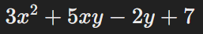

Rozhodni, zda jsou následující výrazy rovné:  
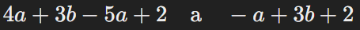

# Zápis slovního textu pomocí výrazů s proměnnými

Zapiš následující slovní úlohu pomocí algebraického výrazu:
Třikrát větší číslo než součet čísel x a y je rovno rozdílu mezi číslem 2z a 5.

Zapiš následující slovní úlohu pomocí algebraického výrazu:
Součet dvou čísel A a B je roven jejich rozdílu zvětšenému o c.

# Výpočet hodnoty výrazu pro dané hodnoty proměnných
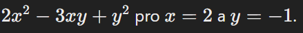  
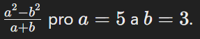

# Početní operace s mnohočleny (max. druhého stupně)
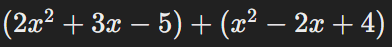    
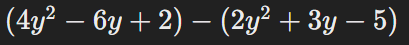       
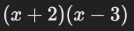 

# Rozkald mnohočlenu na součin pomocí vytýkání
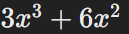  
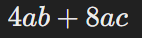  

# Umocnění a rozklad dvojčlenů na součin pomocí vzorců

tyto vzorce budou i u přojímaček jenom se s nimi musíme naučit pracovat  
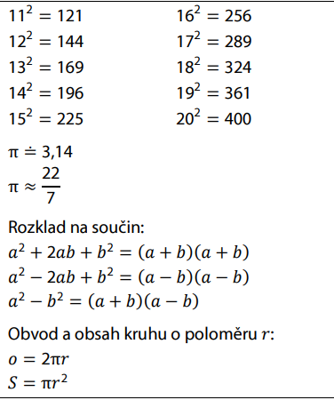  

Rozlozit na soucin pomocí vzorce  
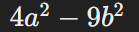  

Umocneni pomocí vzorce  
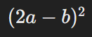  

Zjednoduš výraz pomocí vzorce  
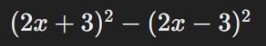  

